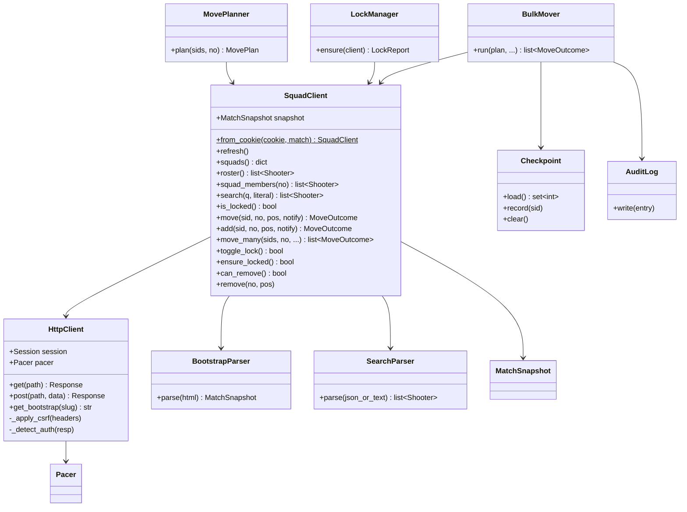

# PractiScore Squadding — Implementation Guide

**Companion to** [`spec.md`](./spec.md). The spec is the source of truth for *what* (requirements §0) and *what the API does* (§1–§8). This document is the source of truth for *how to build it*: package layout, class architecture, control flow, and the CLI contract.

Requirement tags (`F#`, `NF#`) and API section refs (`§3.4`) point back into `spec.md`.

---

## 1. Technology choices

| Concern | Choice | Why |
|---|---|---|
| Language | Python **3.11+** | `X \| Y` unions, `tomllib` in stdlib, `StrEnum`. |
| HTTP | **`requests`** + `requests.Session` | Spec assumes a session-cookie client (NF1); simple, synchronous, matches the "not-fast, reliable" goal (NF6). |
| HTML parsing | **`lxml`** via `BeautifulSoup(features="lxml")` | Robust against the server-rendered Laravel markup (§3.1). |
| CLI framework | **`click`** | Declarative commands/options, good `--help`, testable via `CliRunner`. |
| Terminal UI | **`rich`** | Tables (NF3), progress bar (NF6), and correct UTF-8 rendering on the Windows console (NF11). |
| Config | **TOML** (`tomllib` read, `tomli-w` write) | Human-editable default-match/config file (F0). |
| Packaging (v1) | plain repo + `pyproject.toml`, run via `python -m practiscore_squads` or a `console_scripts` entry point | No PyPI/`.exe` in v1 (§0.4). |

Runtime deps: `requests`, `beautifulsoup4`, `lxml`, `click`, `rich`, `tomli-w`. Dev: `pytest`, `responses` (HTTP mocking), `ruff`.

---

## 2. Package layout

```
practiscore-lib/
├── pyproject.toml
├── spec.md
├── implementation.md
└── src/
    └── practiscore_squads/
        ├── __init__.py          # public exports: SquadClient, models, errors
        ├── __main__.py          # `python -m practiscore_squads` → cli.main:cli (§5)
        ├── errors.py            # exception hierarchy (spec §5.4)
        ├── models.py            # Slot, Shooter, MoveOutcome, MatchSnapshot, Cmd, LockState
        ├── pacing.py            # Pacer: jitter + exponential backoff (NF6)
        ├── http.py              # HttpClient: session, headers, CSRF, retry, auth detection
        ├── parsing.py           # BootstrapParser, SearchParser
        ├── client.py            # SquadClient — library core (spec §5.2)
        ├── planner.py           # MovePlanner, PlannedMove, MovePlan (dry-run, NF5)
        ├── bulk.py              # BulkMover — progress + resume orchestration (F4/NF6)
        ├── lock.py              # LockManager (NF7)
        ├── checkpoint.py        # Checkpoint store (NF6 resume)
        ├── audit.py             # AuditLog writer (NF8)
        ├── config.py            # Config load/save, match resolution (F0/NF1)
        ├── formatting.py        # TableFormatter / JsonFormatter (NF3)
        └── cli/
            ├── __init__.py
            ├── main.py          # click group, global options, wiring
            └── commands.py      # command handlers (F0–F4)
```

**Dependency direction** (lower may not import higher):

```
cli ─► {formatting, config, bulk, planner, lock, audit, checkpoint} ─► client ─► {http, parsing, models, pacing, errors}
```

The **core** (`client` + below) has zero knowledge of config, checkpoints, audit, or the terminal. All product policy lives in the layers `client` and above but below `cli`.

---

## 3. Class architecture



### 3.1 `models.py` — domain types

Frozen dataclasses; no behavior beyond derivation and address rendering. See spec §5.1 for `Slot`, `Shooter`, `MoveOutcome`, `Cmd`. Additions here:

```python
class LockState(StrEnum):
    LOCKED = "locked"
    UNLOCKED = "unlocked"

@dataclass(frozen=True)
class MatchSnapshot:
    """Everything scraped from one bootstrap page load (§3.1). Immutable; replaced wholesale on refresh()."""
    slug: str
    match_id: int
    csrf: str
    lock: LockState
    slots: tuple[Slot, ...]                       # every rendered slot, all squads
    schedule_ids: tuple[int, ...]                 # toggle_schedule_* (usually one; §2.4)
    fetched_at: float                             # monotonic; used for staleness checks

    def by_squad(self) -> dict[int, list[Slot]]:  # keyed by displayed squad_no
        ...
    def slot(self, squad_no: int, position: int) -> Slot | None: ...
    def squad_ids(self) -> dict[int, int]:        # squad_no -> squad_id
        ...
```

`Shooter.__repr__` and `__str__` **must not** include `email` (NF9). Provide an explicit `to_audit_dict()` that *does* include it — used only by `AuditLog`.

### 3.2 `pacing.py` — `Pacer`

Single responsibility: never let the process burst the API (NF6, §6/§7 Q9).

```python
class Pacer:
    def __init__(self, min_gap=0.8, max_gap=1.6, backoff_base=2.0, backoff_cap=60.0): ...
    def wait(self) -> None:
        """Sleep a jittered gap since the last request so consecutive calls stay near-human."""
    def penalize(self, attempt: int) -> None:
        """Exponential backoff sleep after a 429/503/Cloudflare block: min(cap, base**attempt) + jitter."""
    def reset(self) -> None: ...
```

- `wait()` is called by `HttpClient` before **every** request.
- `penalize()` is called by the retry loop on throttle responses.
- Gaps are randomized (`random.uniform(min_gap, max_gap)`) to avoid a fixed cadence.

### 3.3 `http.py` — `HttpClient`

Owns the `requests.Session`, header policy, CSRF, retry, and auth/throttle detection. Knows nothing about squads.

Constructed either directly (`HttpClient(session, base=..., pacer=...)`) or via the `from_cookie(cookie, base=..., pacer=...)` classmethod, which builds a fresh `requests.Session`, sets a browser-like `User-Agent` and `X-Requested-With: XMLHttpRequest`, and parses the pasted cookie value (plain or `@file`, NF1) into the session's cookie jar — not a static `Cookie` header — so a `Set-Cookie` the server sends back (e.g. a rotated session id) updates the jar instead of being silently discarded (C5). `get(path, *, headers=None)` and `post(path, *, data=None, csrf=None, headers=None, allow_redirects=True)` both return a `Parsed(status, json, text)`; `csrf` is the token string itself (not a bool) — when given, it is sent as `X-CSRF-TOKEN`. `get_bootstrap(slug)` issues `GET /{slug}/squadding` and returns the raw HTML.

Responsibilities & rules:
- **Headers (spec §5.5):** always `X-Requested-With: XMLHttpRequest` (turns error pages into `{"message":"Server Error"}`), browser-like `User-Agent`, and for writes `Content-Type: application/x-www-form-urlencoded`.
- **CSRF:** inject `X-CSRF-TOKEN` from the current snapshot on writes; caller passes the token in. Even though unenforced (§6.1) — future-proofing. On `419`, signal the client to `refresh()` and retry once.
- **Response handling (spec §5.5):** never branch on `Content-Type`. Return a small `Parsed(status, json, text)` where `json` is `json.loads(text)` attempted-and-ignored. `check` success is `text/html` holding JSON (§8.2), so this must not depend on content type.
- **Auth detection (NF2):** a `302 → /login` on the bootstrap, or a login-page body on a gated route, raises `SessionExpiredError`. A `403`/Cloudflare interstitial raises `ThrottledError` → retry with `pacer.penalize`.
- **Retry loop:** transient (`429`, `503`, connection error) → up to N attempts with `pacer.penalize`. `removeshooter`'s ambiguous `503`-vs-redirect (§3.6) is handled by treating any `3xx`/opaque redirect as success and verifying via re-read rather than trusting the status.
- **Redirects:** `post(..., allow_redirects=False)` for `removeshooter`; treat `3xx` as success.

### 3.4 `parsing.py`

```python
class BootstrapParser:
    _SLOT_RE = re.compile(r"^squad_(\d+)_(\d+)_(\d+)$")
    def parse(self, html: str, slug: str) -> MatchSnapshot:
        # csrf: meta[name=csrf-token]; match_id from slot ids; lock from #lockSquadding class/text;
        # slots from input[id^=squad_] (rel=squad_no, value=occupant, data-original-title, disabled,
        #   placeholder=="reserved"); squad names from strong#squadBox_*; schedules from toggle_schedule_*.
        # .strip() all names (§3.2). squad_no comes from rel (§2.1).

class SearchParser:
    def parse(self, parsed: Parsed) -> list[Shooter]:
        # parsed.json is a list; map id/name(strip)/email/shDiv/shClass; [] on no-match; raise ServerError on 500.
```

Lock parsing: `btn-primary`/"Lock Squadding" ⇒ `UNLOCKED`; `btn-danger`/"Unlock Squadding" ⇒ `LOCKED` (§2.4).

### 3.5 `client.py` — `SquadClient` (core)

The public library entry point. Holds one `HttpClient` and the latest `MatchSnapshot`. Signatures per spec §5.2. Internal contracts:

- **`from_cookie(cookie, match)`** builds `HttpClient.from_cookie`, stores the parsed slug (accepts slug or full URL via `config.parse_match`), calls `refresh()`.
- **`refresh()`** = `get_bootstrap` → `BootstrapParser.parse` → replace `self.snapshot`. Every read/mutation uses the snapshot; callers refresh before batches.
- **`search(q, literal=True)`** escapes `%`→`\%`, `_`→`\_` when literal; reuses one valid slot id (any squad; §3.2 scoping). `roster()` = `search("%20", literal=False)`. `squad_members(no)` filters the snapshot's occupied slots and correlates names (best-effort; IDs come from `roster()`).
  - **D6 — two known limits of this name correlation, both structural (no scraped field ties an occupant slot to a roster ID):** (1) it matches roster shooters to snapshot occupants **by display name**, so two shooters sharing a name mis-attribute — one may be reported as occupying the other's slot. (2) a slot this process just filled via `move()`/`move_many()` is marked non-free locally (`Slot.claimed`, §3.1) but carries no `occupant` name until the next `refresh()`, so `free_slots()` correctly excludes it while `squad_members()` does not yet include it — the two views briefly disagree about the same write.
- **`move(shooter_id, squad_no, position=None, notify=False)`** — the safety-critical path (NF10). Algorithm in §4.1.
- **`move_many(...)`** **owns** the batch loop: slot pre-assignment, pacing, continue-and-report, and the `skip=`/`on_progress=` hooks. It never touches disk — `BulkMover` layers checkpoint and audit on top via those hooks (§3.6). The dependency runs one way only (`bulk ─► client`, §2); the core never calls up into `BulkMover`.
- **`ensure_locked()`** reads `snapshot.lock`; toggles only if `UNLOCKED`; returns whether it locked (NF7).

`SquadClient` **raises** only hard faults (`AuthError`, `SessionExpiredError`, `ServerError`, `UnexpectedResponseError`); control-flow states (`taken`, `same`) become `MoveOutcome(ok=...)`.

### 3.6 Orchestration layer

**`planner.py`** — pure, no I/O beyond reads. Produces a reviewable plan for the dry-run (NF5).

```python
@dataclass(frozen=True)
class PlannedMove:
    shooter_id: int
    shooter_name: str
    from_squad: int | None
    to_squad: int
    kind: str                 # "move" | "add" | "noop(already there)" | "blocked(no free slot)"

@dataclass(frozen=True)
class MovePlan:
    target_squad: int
    moves: list[PlannedMove]
    def actionable(self) -> list[PlannedMove]: ...   # excludes noop/blocked

class MovePlanner:
    def __init__(self, client: SquadClient): ...
    def plan(self, shooter_ids: list[int], squad_no: int) -> MovePlan:
        # refresh(); for each id determine current squad (from roster/snapshot) and whether a free
        # target slot exists; classify without mutating.
```

**`bulk.py`** — `BulkMover` is a **thin wrapper** over `SquadClient.move_many`. The loop, pacing, and continue-and-report semantics live in the core; `BulkMover` only adds the two disk-backed concerns the core refuses to know about — checkpoint and audit (F4/NF5/NF6).

```python
class BulkMover:
    def __init__(self, client, checkpoint: Checkpoint, audit: AuditLog, on_progress=None): ...
    def run(self, plan: MovePlan, *, notify=False) -> list[MoveOutcome]:
        done = self.checkpoint.load()                    # resume (NF6)
        ids = [pm.shooter_id for pm in plan.actionable()]

        def _progress(oc, i, total):
            # Runs per attempt, BEFORE any batch-fatal raise — so a run that aborts
            # still leaves a complete checkpoint + audit trail behind it.
            self.audit.write(oc)                         # emails included (NF8)
            if oc.ok: self.checkpoint.record(oc.shooter_id)
            if self.on_progress: self.on_progress(oc, i, total)

        outcomes = self.client.move_many(ids, plan.target_squad, notify=notify,
                                         skip=done, on_progress=_progress)
        self.checkpoint.clear()                          # clean finish only
        return outcomes
```

**Continue-and-report (NF5):** a per-item `taken`/`same`/`blocked`, or any other `SquaddingError`, becomes a `MoveOutcome` and never aborts the loop.

**Batch-fatal (NF2/NF6):** `AuthError` (incl. `SessionExpiredError`) and `ThrottledError` propagate out of `move_many`. A dead session cannot recover without a new cookie, and rate limiting only worsens if every remaining shooter burns another retry budget against it (~15s each — roughly 75 min over the spec's 300-shooter target). `TransportError` is *not* batch-fatal: it is recorded per item, since an isolated host blip should not end a run.

Because `checkpoint.clear()` sits after the call, a batch-fatal raise leaves the checkpoint intact and the run resumes from it.

**`lock.py`**

```python
@dataclass(frozen=True)
class LockReport:
    final: LockState
    locked_by_this_run: bool

class LockManager:
    def ensure(self, client: SquadClient) -> LockReport:
        locked_now = client.ensure_locked()
        return LockReport(LockState.LOCKED, locked_now)
```

CLI prints the report at the end; **never auto-unlocks** (NF7).

**`checkpoint.py`** — JSON file `~/.practiscore-squads/checkpoints/<slug>-to<squad>.json` (or CWD fallback): `{ "slug", "target_squad", "notify", "done": [ids], "updated": iso }`. `load()` returns the `done` set only if slug+target+notify match the current run (else ignored). `clear()` deletes on clean finish. Distinct from audit (NF6).

**`audit.py`** — append-only JSONL (default) or CSV at `~/.practiscore-squads/audit/<slug>.jsonl`. One record per attempted move: `timestamp, shooter_id, name, email, from_squad, to_squad, outcome, notify`. **Emails included** by owner choice (NF8); file kept local, never network-sent, `chmod 600` on POSIX. `AuditLog.write(MoveOutcome)` resolves the shooter's name/email from a roster cache.

### 3.7 CLI layer

**`config.py`**

```python
@dataclass
class Config:
    default_match: str | None
    cookie: str | None            # discouraged in file; prefer env/flag
    audit_dir: Path
    audit_format: str             # "jsonl" | "csv"

def load() -> Config: ...                          # TOML at ~/.practiscore-squads/config.toml
def save(cfg: Config) -> None: ...
def resolve_match(cli_value, cfg) -> str:          # F0: --match > default > error
def parse_match(value: str) -> str:                # slug or https://practiscore.com/{slug}/squadding -> slug
def resolve_cookie(cli_value, cfg) -> str:         # NF1: --cookie > env PRACTISCORE_COOKIE > config > prompt
```

**`formatting.py`** — one interface, two renderers (NF3).

```python
class Formatter(Protocol):
    def squads(self, snapshot: MatchSnapshot) -> None: ...
    def shooters(self, rows: list[Shooter], squad_no: int | None) -> None: ...  # (name, ID); NO email (NF9)
    def plan(self, plan: MovePlan) -> None: ...
    def outcomes(self, outcomes: list[MoveOutcome]) -> None: ...
    def lock(self, report: LockReport) -> None: ...

class TableFormatter:  # rich tables, human default
class JsonFormatter:   # json.dump to stdout for --json
```

`shooters`/all outputs **omit email** in both renderers (NF9). `JsonFormatter.plan` on a dry-run emits the plan and the command exits 0 without executing.

**`cli/main.py`** — click group holding the global options (§5), constructs a `Context` object carrying resolved `Config`, `Formatter`, and a lazy `SquadClient` factory (built only when a command needs the network).

---

## 4. Key control flows

### 4.1 Single move — `SquadClient.move` (NF10, guards §3.4 & §3.3/§6.8)

```
move(shooter_id, squad_no, position=None, notify=False):
    if snapshot older than SNAPSHOT_TTL: refresh()      # `_refresh_if_stale`, §3.5
    squad_id = snapshot.squad_ids()[squad_no]          # else SlotNotFoundError
    slot = chosen scraped slot:
        - if position given: snapshot.slot(squad_no, position) or SlotNotFoundError   # blocks out-of-range (§6.8)
        - else: first slot in squad where slot.free                                   # else MoveOutcome(ok=False,"blocked: squad full")
    if not slot.free: return MoveOutcome(ok=False, "taken")                            # never save onto occupancy (§3.4)
    r = POST /squads/check/{slot.as_squad()}/{shooter_id}   body email=0|1
    match r.cmd:
        "added": claim slot locally; return MoveOutcome(ok=True, to=squad_no, detail="added")
        "same" : return MoveOutcome(ok=True,  to=squad_no, detail="already there")     # idempotent
        "taken": return MoveOutcome(ok=False, to=squad_no, detail="taken")
        "move" : from_no = r.num
                 b = POST /squads/save/{slot.as_squad()}/{shooter_id}  body send=no|yes
                 if b.strip() != "moved": raise UnexpectedResponseError                # §3.4 guard
                 claim slot locally; return MoveOutcome(ok=True, from=from_no, to=squad_no, detail="moved")
```

Only `save` when `check` said `move`; only ever target a scraped, free slot. These two rules neutralize the double-assignment (§3.4) and hidden-out-of-range (§6.8) hazards.

**D2 — claim-plus-TTL, not refresh-per-write.** A committed `added`/`move` does not trigger an immediate `refresh()` to "verify" the write — that would cost a full bootstrap fetch per move (~300 shooters would double the request count, NF6). Instead the target `Slot` is marked `claimed=True` in the in-memory snapshot (`SquadClient._claim_slot`), which is enough for `free_slots()`/auto-pick to stop re-offering a slot this process just filled. The snapshot as a whole is only re-scraped when it exceeds `SNAPSHOT_TTL` (120s, matching the page's own 120s self-refresh, §3.1) via `_refresh_if_stale()`, called at the top of `move()`. A real `refresh()` always **discards** accumulated `claimed` flags — server truth outranks local bookkeeping, since another admin or the public UI may have mutated the same squad meanwhile (§3.8).

### 4.2 Bulk move with resume & session expiry (F4/NF2/NF6)

```mermaid
sequenceDiagram
    participant U as User
    participant CLI
    participant BM as BulkMover
    participant C as SquadClient
    participant CK as Checkpoint
    U->>CLI: move-bulk --to 3 --ids-file ids.txt
    CLI->>C: refresh(); LockManager.ensure()
    CLI->>CLI: MovePlanner.plan() -> print dry-run
    U-->>CLI: confirm (or --yes)
    CLI->>BM: run(plan)
    BM->>CK: load() -> done
    BM->>C: move_many(ids, 3, skip=done, on_progress=_progress)
    loop each shooter not in done
        C->>C: move(id, 3)
        alt AuthError / ThrottledError (batch-fatal)
            C-->>BM: raise
            BM-->>CLI: bubble (checkpoint NOT cleared)
            CLI-->>U: "session expired — paste fresh cookie" / "rate limited — resume later"
            U-->>CLI: new cookie
            CLI->>C: rebuild session; re-run (done set preserved)
        else outcome (incl. TransportError)
            C->>BM: _progress(outcome, i, total)
            BM->>CK: record(id) if ok
            BM->>BM: audit.write; on_progress(bar)
        end
    end
    C-->>BM: outcomes
    BM->>CK: clear()
    CLI->>U: results table + Lock: LOCKED (locked by this run)
```

### 4.3 Match & cookie resolution (F0/NF1)

`resolve_match`: `--match` → `config.default_match` → error "no match; pass --match or run `config set-default`". `parse_match` accepts `test-reverse-engineer` or the full squadding URL. `resolve_cookie`: `--cookie` (value or `@file`) → `PRACTISCORE_COOKIE` env → config → interactive prompt (hidden input). Cookie is never written to logs, audit, or checkpoint.

---

## 5. CLI API

Invocation (v1): `python -m practiscore_squads <global-opts> <command> <args>` (a `practiscore-squads` console-script alias is defined in `pyproject.toml`).

Exit codes: `0` success · `1` runtime error (network, parse) · `2` usage error (click) · `3` auth/session (bad or expired cookie, unresolved) · `4` partial failure (`move` returned `taken`/blocked, or a bulk run completed with ≥1 move failed) · `5` throttled — `move-bulk` stopped on a batch-fatal `ThrottledError` (§3.6); partial and resumable from the checkpoint · `130` user aborted at confirm.

### 5.1 `config set-default`

Save the default match to the local config so later commands need no `--match` (F0).

```
practiscore-squads config set-default --match test-reverse-engineer
practiscore-squads config set-default --match https://practiscore.com/test-reverse-engineer/squadding
```

- Writes `default_match` (normalized to slug) to `~/.practiscore-squads/config.toml`.

### 5.2 `squads` — list all squads (F1)

```
practiscore-squads squads
practiscore-squads --json squads
```

- Loads the bootstrap, prints one row per squad: **displayed number**, name, occupied/total, free count.
- `--json`: `[{ "squad_no", "name", "capacity", "occupied", "free" }]`.
- Read-only; does **not** lock.

Sample table:

```
Squad  Name      Occupied  Free
1      Squad 1   1/5       4
2      Squad 2   1/5       4
3      Squad 3   0/5       5
```

### 5.3 `shooters` — list roster / squad members (F2)

```
practiscore-squads shooters                 # whole match roster
practiscore-squads shooters --squad 2       # only shooters in Squad 2
practiscore-squads --json shooters
```

- Output is `(name, ID)` plus division/class. **Email is never shown** (NF9).
- `--squad N` filters to one displayed squad.
- `--json`: `[{ "id", "name", "division", "class", "squad_no" | null }]`.

Sample table:

```
ID        Name                          Div         Squad
9808574   Grzegorz Brzęczyszczykiewicz  Production   1
9808577   Anatoli Putseyeu              Standard     2
```

### 5.4 `move` — single move (F3)

```
practiscore-squads move 9808574 --to 3
practiscore-squads move 9808574 --to 3 --position 2
practiscore-squads move 9808574 --to 3 --yes --notify
practiscore-squads --json move 9808574 --to 3 --dry-run
```

- Moves one shooter (by ID) to a displayed squad number; `--position` optional (default first free slot).
- **Locks** the match if unlocked (NF7), prints a **dry-run** line and asks to confirm (NF5) unless `--yes`. `--dry-run` (D5) prints the plan and exits `0` without executing — same as `move-bulk --dry-run`, and works with `--json`.
- On success prints the outcome and the lock-status line.
- **Exit codes (D4):** `0` for `moved`/`added`/`already there`; `4` for `taken` or `blocked: squad full` — so `move … && echo ok` only reports success when a shooter actually ended up in the target squad. A hard fault (`AuthError`, `ServerError`, etc.) still exits per the codes in §5.

### 5.5 `move-bulk` — bulk move (F4)

```
practiscore-squads move-bulk --to 3 --ids 9808574,9808577
practiscore-squads move-bulk --to 3 --ids-file squad3.txt
practiscore-squads move-bulk --to 3 --ids-file squad3.txt --yes
practiscore-squads --json move-bulk --to 3 --ids-file squad3.txt --dry-run
```

- `--ids a,b,c` or `--ids-file <path>` (one ID per line, `#` comments allowed). Exactly one required.
- Flow: refresh → **lock if needed** → **plan** → print dry-run (count of moves/no-ops/blocked) → confirm (or `--yes`) → execute with a **progress bar** → **checkpoint** each success → **audit** every attempt → print a results summary + lock status.
- **Resumable:** re-running the same `--to`/ids after an interruption skips already-done shooters (NF6). `--fresh` ignores/clears any existing checkpoint.
- **Continue-and-report:** finishes all it can; prints a table of failures with reasons (NF5). Exit code `4` if any failed.
- **Session expiry:** pauses and prompts for a fresh cookie mid-run, then resumes (NF2).
- **Throttled abort (D3):** a `ThrottledError` is batch-fatal (§3.6) and stops the run; exit code `5` — the checkpoint is left intact, so the same command resumes where it stopped once rate limiting clears.

Results summary:

```
Moved 2  •  Already there 0  •  Blocked/taken 0  •  Failed 0
Lock: LOCKED (locked by this run)
Audit: ~/.practiscore-squads/audit/test-reverse-engineer.jsonl
```

---

## 6. CLI options

### 6.1 Global options (apply to every command; place before the command)

`--yes` and `--notify` are additionally declared on `move` and `move-bulk`, so they are accepted **on either side** of the command name (see the note under §6.2). Every other option in this table is group-level only and must precede the command.

| Option | Arg | Default | Requirement | Meaning |
|---|---|---|---|---|
| `--match` | `<slug\|url>` | config `default_match` | F0 | Target match; overrides the saved default. Accepts slug or full squadding URL. |
| `--cookie` | `<value\|@file>` | env `PRACTISCORE_COOKIE` → config → prompt | NF1 | Session cookie header. `@path` reads from a file. Never logged. |
| `--json` | flag | off (tables) | NF3 | Machine-readable JSON to stdout instead of rich tables. |
| `--yes` / `-y` | flag | off | NF5 | Skip the dry-run confirmation prompt (for scripting). |
| `--notify` | flag | off (silent) | NF4 | Send PractiScore emails for moves (`email=1`/`send=yes`). Default suppresses. |
| `--quiet` / `-q` | flag | off | — | Suppress progress bar / non-essential output. |
| `--verbose` / `-v` | flag | off | — | Debug logging to **stderr** (never includes cookie or email). |
| `--version` | flag | — | — | Print version and exit. |
| `--help` | flag | — | — | click-generated help. |

### 6.2 Command-specific options

| Command | Option | Arg | Default | Meaning |
|---|---|---|---|---|
| `config set-default` | `--match` | `<slug\|url>` | — (required) | Match to store as default (F0). |
| `squads` | *(none)* | | | Lists all squads (F1). |
| `shooters` | `--squad` | `<N>` | all | Limit to one displayed squad (F2). |
| `move` | `--to` | `<N>` | — (required) | Destination displayed squad number (F3). |
| `move` | `--position` | `<P>` | first free | Specific slot position within the target squad. |
| `move` | `--dry-run` | flag | off | Print the plan and exit without executing (works with `--json`; D5). |
| `move-bulk` | `--to` | `<N>` | — (required) | Destination squad for the whole batch (F4). |
| `move-bulk` | `--ids` | `a,b,c` | — | Inline shooter IDs (mutually exclusive with `--ids-file`). |
| `move-bulk` | `--ids-file` | `<path>` | — | File of shooter IDs, one per line (`#` comments ok). |
| `move-bulk` | `--dry-run` | flag | off | Print the plan and exit without executing (works with `--json`). |
| `move-bulk` | `--fresh` | flag | off | Ignore and clear any existing resume checkpoint (NF6). |
| `move`, `move-bulk` | `--yes` / `-y` | flag | off | Command-level twin of the global flag (§6.1); accepted on either side of the command name. |
| `move`, `move-bulk` | `--notify` | flag | off | Command-level twin of the global flag (§6.1); accepted on either side of the command name. |

Notes:
- `--yes` and `--notify` are declared **at both levels** — on the group (§6.1) *and* on `move`/`move-bulk` — so both `--yes move-bulk …` and `move-bulk … --yes` parse. Click gives each level its own parameter, so the command-level value wins when supplied; when it is absent the group-level value carries through the click context. Both flags default to off, so the effective rule is simply **either position turns it on**. This is why the examples in §5.4/§5.5 place them after the command while §5.2/§5.3 place `--json` before it — `--json` is group-only.
- `--to`/`--position`/`--squad` are **displayed** numbers (F0); the tool maps them to internal `squad_id`.
- On any mutating command, if the resolved session is unauthenticated the tool exits `3` with guidance to refresh the cookie (see the Firefox/Chrome how-to, NF1) — that how-to ships in `README.md`, not this file.

---

## 7. Config, checkpoint, and audit file formats

**Config** — `~/.practiscore-squads/config.toml`
```toml
default_match = "test-reverse-engineer"
audit_dir     = "~/.practiscore-squads/audit"
audit_format  = "jsonl"          # or "csv"
# cookie is intentionally NOT stored here by default; prefer PRACTISCORE_COOKIE env or --cookie
```

**Checkpoint** — `~/.practiscore-squads/checkpoints/<slug>-to<N>.json` (NF6)
```json
{ "slug": "test-reverse-engineer", "target_squad": 3, "notify": false,
  "done": [9808574, 9808577], "updated": "2026-07-26T22:10:00Z" }
```
Loaded only when `slug`+`target_squad`+`notify` match the current run; deleted on clean finish.

**Audit** — `~/.practiscore-squads/audit/<slug>.jsonl` (NF8; emails included, local only)
```json
{"ts":"2026-07-26T22:10:03Z","shooter_id":9808574,"name":"Grzegorz Brzęczyszczykiewicz","email":"…","from_squad":2,"to_squad":3,"outcome":"moved","notify":false}
```

---

## 8. Testing strategy

- **Unit (offline):** `BootstrapParser`/`SearchParser` against saved HTML/JSON fixtures (captured from the sandbox, emails scrubbed in fixtures). `Pacer`, `MovePlanner`, `Checkpoint`, `config.resolve_*` are pure and fully unit-testable. Mock HTTP with `responses`.
- **Move-safety tests:** assert `move` never issues `save` unless `check` returned `move`, and refuses occupied/out-of-range targets (NF10) — table-driven over the four `cmd` branches (§8.2 A2–A11).
- **CLI tests:** click `CliRunner` for option parsing, dry-run/confirm gating, `--json` shape, exit codes.
- **Integration (opt-in, sandbox only):** a `--sandbox` marker runs against `test-reverse-engineer` (matchId 351459) with a real cookie from env; each test restores initial layout, `email=0`/`send=no` throughout (mirrors spec §8.2 discipline). Never run against a live match.

---

## 9. Build order (suggested)

1. `models`, `errors`, `pacing` — pure, no deps.
2. `http` + `parsing` — with fixture tests.
3. `client` — the core; integration-test reads against the sandbox.
4. `planner` + single `move` safety.
5. `checkpoint`, `audit`, `bulk` — resume + continue-and-report.
6. `lock`, `config`, `formatting`.
7. `cli` — wire it together; `CliRunner` tests.
8. `README.md` with the Firefox/Chrome cookie how-to (NF1).

---

## 10. Backlog

**Status:** steps 1–3 of §9 are done — `models`, `errors`, `pacing`, `http`, `parsing`, `client` are implemented with 89 passing tests. Steps 4–8 are unbuilt: `planner`, `bulk`, `lock`, `checkpoint`, `audit`, `config`, `formatting`, and the whole `cli/` package exist only as designs in §3.6/§3.7.

Each task below is self-contained: it names its own files and its own definition of done, and can be picked up without any other task being finished first. Where a genuine ordering constraint exists it is stated as **Needs:**; everything without that line is unblocked today.

### 10.1 Documentation alignment

- [ ] **D1 — Replace the `HttpClient` signature block with prose.** §3.3's code block has drifted from `http.py` (it shows `get(path, *, params, expect_json)` and `csrf=True`; the code has `get(path, *, headers)` and `csrf: str | None` carrying the token). Describe the responsibilities in prose so there is no second signature to keep in sync. *Done when:* §3.3 contains no Python signature block and the surrounding rules still cover headers, CSRF, retry, auth detection, and redirects.
- [ ] **D2 — Update §4.1 for the claim-plus-TTL model.** The pseudocode still says `verify via refresh` and `refresh()` after each committed write. The implementation marks the target slot `claimed` locally and only re-scrapes when the snapshot exceeds `SNAPSHOT_TTL`. *Done when:* §4.1 describes local claiming, the TTL trigger, and the fact that a refresh discards claims because server state outranks local bookkeeping.
- [ ] **D3 — Add exit code `5` for a throttle-aborted run.** §5's exit-code list has no entry for a bulk run that stops on `ThrottledError`, which is now batch-fatal (§3.6). *Done when:* `5` is defined as "throttled — partial, resumable from checkpoint" in §5 and referenced from §5.5.
- [ ] **D4 — Specify `move` exit codes.** §5.4 currently says only that "a real fault exits non-zero", which leaves a `taken` result exiting `0` — so `move … && echo ok` reports success when nothing moved. *Done when:* §5.4 states `4` for `taken`/`blocked` and `0` for `already there`.
- [ ] **D5 — Add `--dry-run` to `move`.** `move-bulk` has one; `move` has only an interactive confirm. *Done when:* §5.4 shows an example and §6.2 has the row.
- [ ] **D6 — Document the `squad_members()` correlation limits.** It matches roster IDs to snapshot occupants **by name**, so same-named shooters mis-attribute; and a slot filled by this process is non-free but still nameless until the next refresh, so `free_slots()` sees a write that `squad_members()` does not. *Done when:* §3.5 states both limits.

### 10.2 Core library

- [ ] **C1 — Test the TTL staleness refresh.** `SquadClient._refresh_if_stale()` and `SNAPSHOT_TTL` shipped without a test; nothing pins that an expired snapshot re-scrapes or that a fresh one does not. *Done when:* tests cover both directions (construct with `snapshot_ttl=0` to force, and the default to suppress) and assert the bootstrap request count.
- [ ] **C2 — Prove the UTF-8 guard actually guards.** `test_body_without_charset_is_decoded_as_utf8` passes today, but it has not been shown to fail with `resp.encoding = "utf-8"` removed from `http.py::_send` — an assertion that passes either way is worthless. *Done when:* the line has been temporarily removed, the test observed failing, and the line restored.
- [ ] **C3 — Reject malformed match URLs.** `_parse_match_slug` passes non-matching input through verbatim, so `https://practiscore.com/my-match` (no `/squadding`) becomes a slug literally equal to that URL, producing a nonsense request path. *Done when:* URL-shaped input that does not match the squadding pattern raises, with a test.
- [ ] **C4 — Verify the `LIKE` escaping assumption.** `search(literal=True)` escapes `%`/`_` with a backslash, but spec §3.2's verification log never confirmed the backend honours `\` escapes — if it does not, literal searches for names containing `_` silently return the wrong rows. *Done when:* the behaviour is checked against the sandbox and either confirmed in `spec.md` or the escaping strategy is corrected. **Needs:** a sandbox session (§8).
- [ ] **C5 — Preserve rotated session cookies.** `HttpClient.from_cookie` sets `Cookie` as a session header, which suppresses the cookie jar, so any `Set-Cookie` the server sends is silently discarded. Harmless while Laravel does not rotate the session mid-run; breaks the run if it starts to. *Done when:* the pasted header is parsed into `session.cookies` instead, with a test that a server-set cookie survives to the next request.

### 10.3 Orchestration layer (§3.6)

- [ ] **O1 — `checkpoint.py`.** JSON store per §3.6/§7; `load()` honours the slug+target+notify guard, `record()` appends, `clear()` deletes. Pure filesystem, no network. *Done when:* unit-tested against a `tmp_path`, including the guard rejecting a mismatched run.
- [ ] **O2 — `audit.py`.** Append-only JSONL/CSV writer per §3.6/§7. Emails included by owner choice (NF8), file kept local, `chmod 600` on POSIX. *Done when:* unit-tested for both formats and for the permission bits.
- [ ] **O3 — `planner.py`.** `MovePlanner.plan()` classifies each shooter as move/add/noop/blocked without mutating (§3.6). *Done when:* unit-tested over a fixture snapshot covering all four classifications.
- [ ] **O4 — `lock.py`.** `LockManager.ensure()` wrapping `client.ensure_locked()` into a `LockReport` (§3.6). Never auto-unlocks. *Done when:* unit-tested for both already-locked and locked-by-this-run.
- [ ] **O5 — `bulk.py`.** `BulkMover` as the thin wrapper specified in §3.6 — checkpoint and audit layered onto `client.move_many` via `on_progress`, nothing else. *Done when:* tested that a batch-fatal raise leaves the checkpoint intact and a clean finish clears it. **Needs:** O1, O2.

### 10.4 CLI layer (§3.7, §5, §6)

- [ ] **U1 — `config.py`.** TOML load/save plus `resolve_match`, `parse_match`, `resolve_cookie` with the precedence chains in §4.3. *Done when:* unit-tested for each precedence chain including the "no match" error.
- [ ] **U2 — `formatting.py`.** `TableFormatter` and `JsonFormatter` behind one Protocol (§3.7). Email omitted in both (NF9). *Done when:* tested that no renderer emits an email and that `--json` shapes match §5.2–§5.5.
- [ ] **U3 — `cli/main.py`.** click group, the §6.1 global options, and a lazy `SquadClient` factory so read commands do not build a session until needed. *Done when:* `--help` and `--version` work with no cookie present.
- [ ] **U4 — `cli/commands.py`.** The five commands of §5. *Done when:* `CliRunner` covers option parsing, dry-run/confirm gating, `--json` shape, and every exit code in §5. **Needs:** U1, U2, U3, and O1–O5 for `move-bulk`.
- [ ] **U5 — `__main__.py`.** Two lines delegating to `cli.main:cli`, so the `python -m practiscore_squads` form advertised in §5 and `README.md` actually runs. *Done when:* `python -m practiscore_squads --help` exits 0. **Needs:** U3.

### 10.5 Packaging & tooling

- [ ] **P1 — Confirm `py.typed` ships.** The marker file exists but has not been verified to land in a built wheel under the hatchling config. *Done when:* a `python -m build` (or `hatch build`) wheel is inspected and contains `practiscore_squads/py.typed`.
- [ ] **P2 — Sandbox integration suite.** The `sandbox` pytest marker is declared in `pyproject.toml` and deselected by default, but no test uses it. *Done when:* at least one opt-in test exercises a read path against `test-reverse-engineer` per the §8 discipline (restore initial layout, `email=0`/`send=no` throughout).
- [ ] **P3 — Update `README.md` once the CLI exists.** It documents five commands and their flags as though shipped; today none of them run. *Done when:* README either matches the built CLI or carries a prominent "library core only — CLI in progress" note.

### 10.6 Decided — no action

Recorded so they are not re-litigated. Reopen only with a reason.

| Item | Decision |
|---|---|
| `remove()` post-condition re-read (spec §3.6) | **Deferred** — `remove()` is not a v1 CLI command. |
| Audit CLI flags (`--audit-dir`, `--no-audit`) | **Not adding** — config file only. |
| Response bodies in exception messages (NF9) | **Leaving as-is.** Newer errors already omit bodies; older ones interpolate them. |
| Unused exception classes | **Deleted** — `taken`/`same`/`move` are control flow, not faults. |
| ~25 ruff errors under `tests/` | **Leaving as-is** — all ten test files share the flagged import convention. |
| Empty `src/practiscore_squads/cli/` | **Keeping** as the placeholder for U3/U4. |
